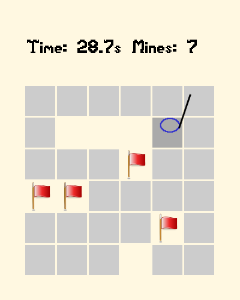
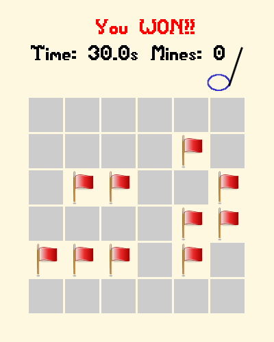

# Sound Minesweeper

Author: Zihao He

Design: Detect mines with your ears! Be careful that it still buzzes when a mine is nearby.

Screen Shot:

How To Play:

When you believe a block contains a mine, right click to mark it. Otherwise, left click to clear the block.

It doesn't matter if you mark an empty block, but it kills you to clear a block with a mine!

Mark all the mines and claim your victory!

Sources:

Images were found on [pngfind](https://www.pngfind.com/). Here are the links: [red flag](https://www.pngfind.com/mpng/ioRRRh_red-flag-picture-red-flag-png-icon-transparent/), [mine](https://www.pngfind.com/mpng/ixwwJbo_mine-png-image-fallout-mine-transparent-png/).

Sound of sand storm was found [here](http://sc.chinaz.com/yinxiao/141019555662.htm). 

This game was built with [NEST](NEST.md).
